# Azure Purview  REST API

[aka.ms/purviewapi](https://aka.ms/purviewapi)

---

## :loudspeaker: Resources

- Blog Post (https://taygan.co)
- Data Governance with Azure Purview (https://aka.ms/purview/L100)
- Azure Purview Lab Exercises (https://aka.ms/purviewlab)
- Azure Purview Best Practices (https://aka.ms/purview/bb)
- Azure Purview CLI (https://aka.ms/purviewcli)
- Azure Purview API (https://aka.ms/purviewapi)

---

## :helicopter: High-Level Overview

---

<!-- _footer: "Azure Purview High-Level Concepts" -->

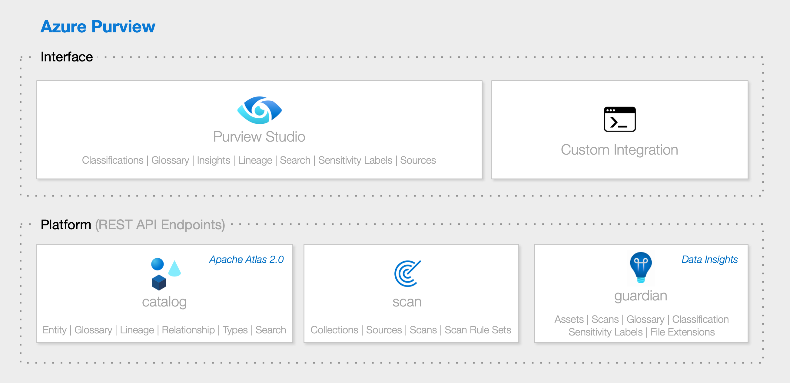

---

## :world_map: Apache Atlas

---
<!-- _footer: "https://atlas.apache.org/" -->

### :world_map: Apache Atlas

> *"Apache Atlas provides open metadata management and governance capabilities for organizations to build a catalog of their data assets, classify and govern these assets and provide collaboration capabilities around these data assets for data scientists, analysts and the data governance team."*

---
<!-- _footer: "https://atlas.apache.org/" -->

### :clock1: Apache Atlas Milestones

- 2015-01-28 [Hortonworks Establishes Data Governance Initiative](https://www.prnewswire.com/news-releases/hortonworks-establishes-data-governance-initiative-300026958.html)
- 2015-05-06 [Apache Atlas submitted to the Apache Software Foundation](https://incubator.apache.org/projects/atlas.html)
- 2017-06-21 [Apache Atlas graduates to a Top-Level Project](https://incubator.apache.org/projects/atlas.html)
- 2018-06-02 [Apache Atlas 1.0.0](https://atlas.apache.org/1.0.0/Downloads.html)
- 2019-05-04 [Apache Atlas 2.0.0](https://atlas.apache.org/2.0.0/Downloads.html)
- 2020-07-15 [Apache Atlas 2.1.0](https://atlas.apache.org/#/Downloads) *(Latest)*

---

<!-- _footer: "https://atlas.apache.org/api/v2/ui/index.html#/" -->

### :computer: Apache Atlas REST API

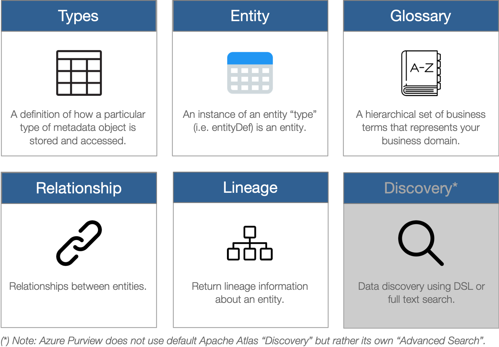

<style>
img[alt~="center"] {
  display: block;
  margin: 0 auto;
}
</style>

---

<!-- _footer: "https://atlas.apache.org/2.0.0/TypeSystem.html" -->

### :book: Apache Atlas Type System
> *"Atlas allows users to define a model for the metadata objects they want to manage. The model is composed of definitions called ‘types’. Instances of ‘types’ called ‘entities’ represent the actual metadata objects that are managed. The Type System is a component that allows users to define and manage the types and entities. All metadata objects managed by Atlas out of the box (like Hive tables, for e.g.) are modelled using types and represented as entities. To store new types of metadata in Atlas, one needs to understand the concepts of the type system component."*

---

<!-- _footer: "https://atlas.apache.org/api/v2/json_AtlasTypesDef.html" -->

### :book: Apache Atlas Type Definitions

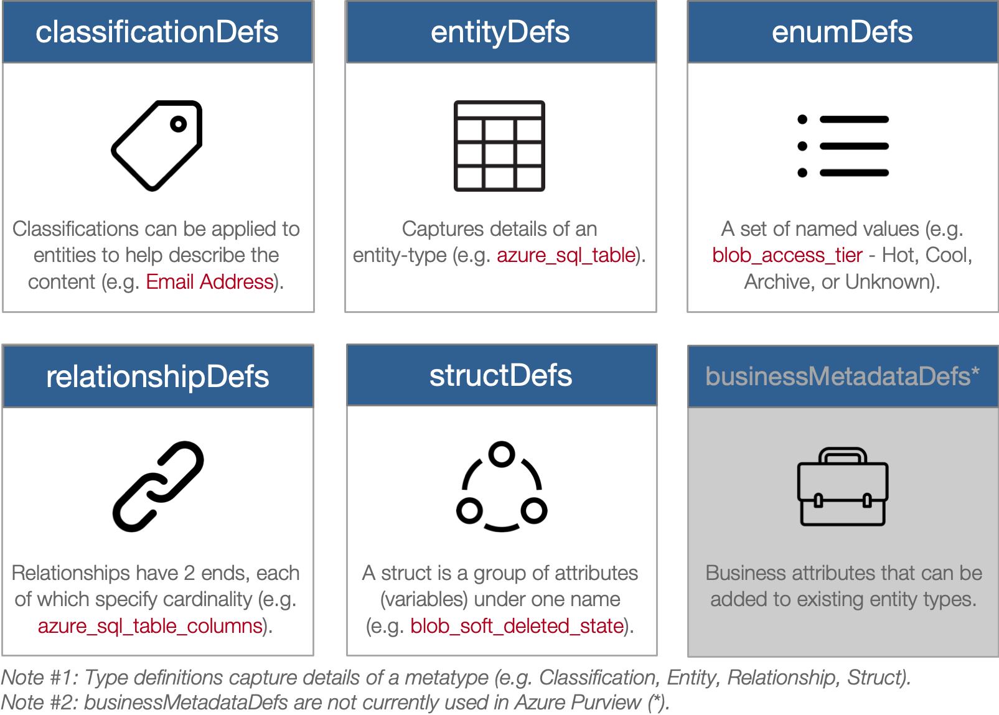

<style>
img[alt~="center"] {
  display: block;
  margin: 0 auto;
}
</style>

---

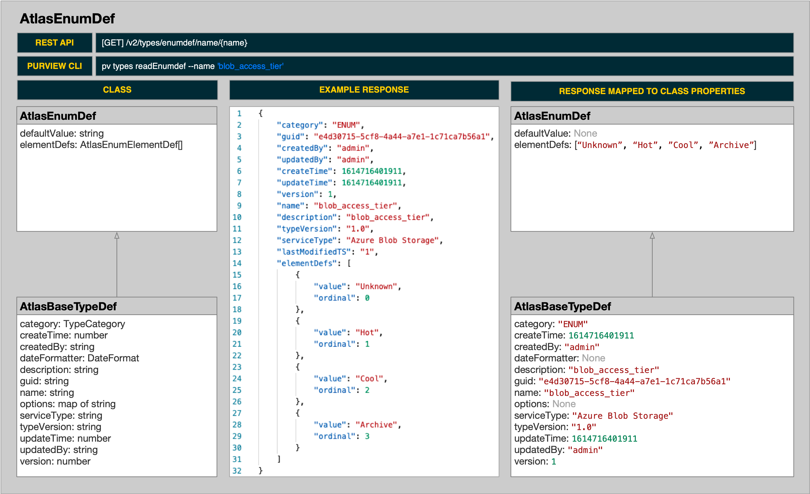

---

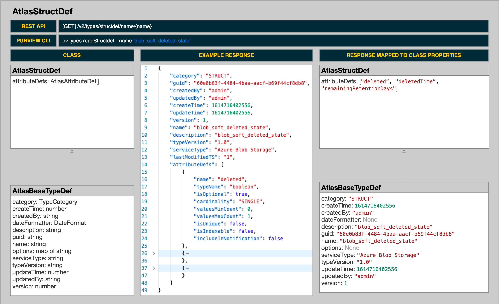

---

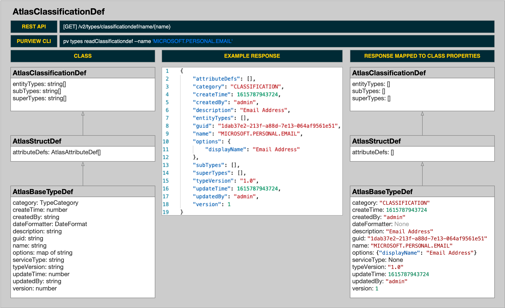

---

<!-- _footer: "https://atlas.apache.org/2.0.0/TypeSystem.html" -->

### :blue_book: Entities
> *"An ‘entity’ in Atlas is a specific value or instance of an Entity ‘type’ and thus represents a specific metadata object in the real world. Referring back to our analogy of Object Oriented Programming languages, an ‘instance’ is an ‘Object’ of a certain ‘Class’."*

---

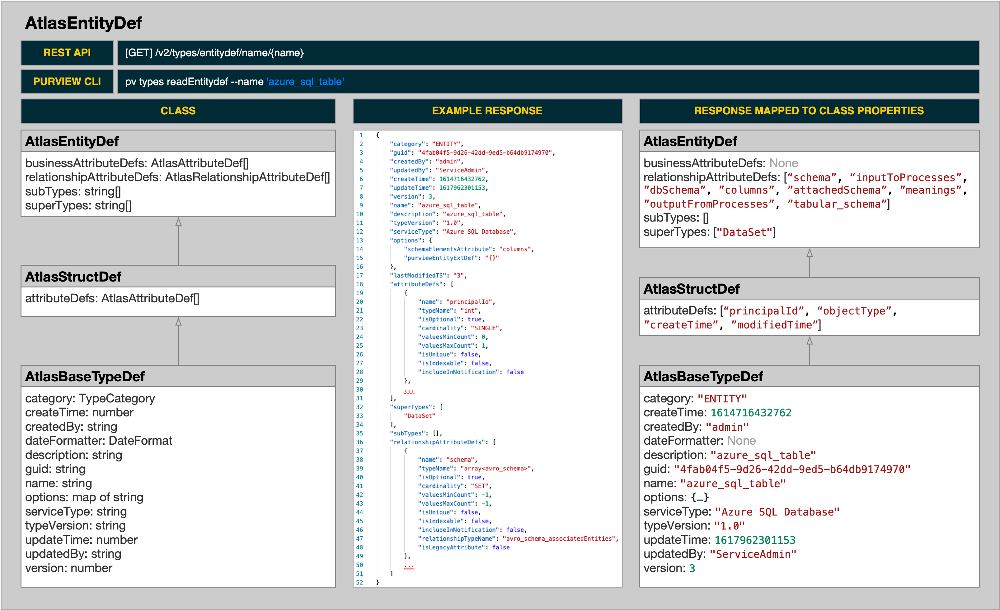

---

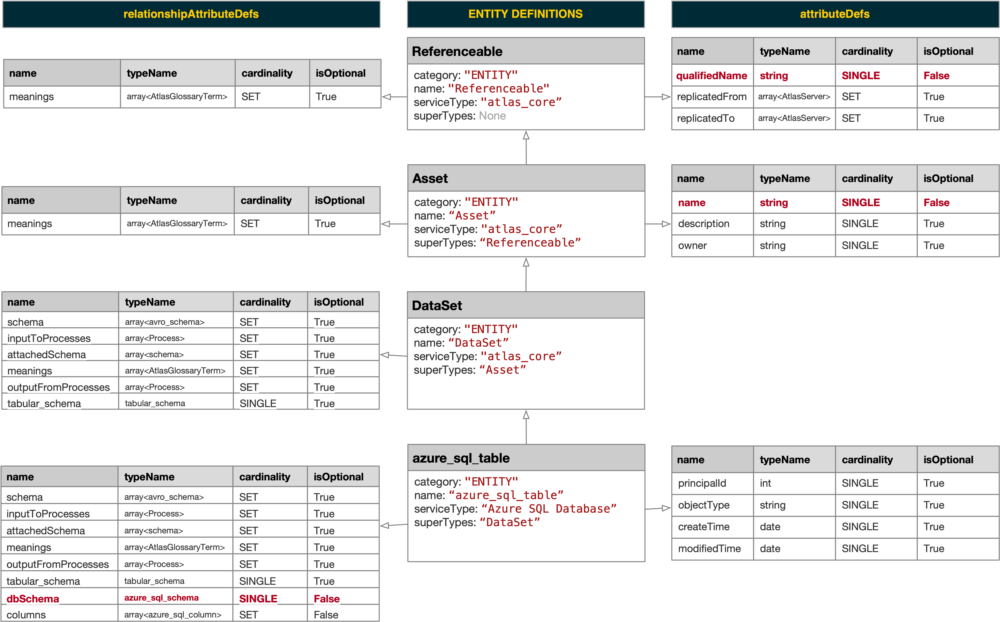

---

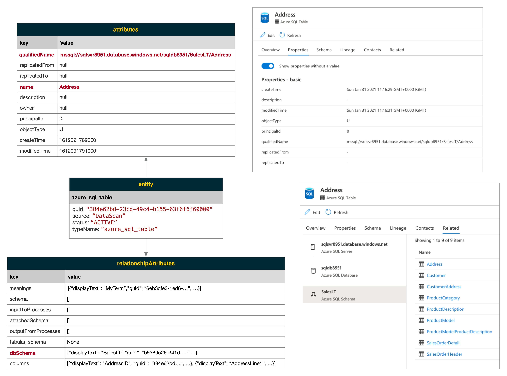

---

<!-- _footer: "https://atlas.apache.org/2.0.0/TypeSystem.html" -->

### :link: Relationships
> *"A ‘relationship’ can be established between entities (e.g. Table <---> Columns)." Relationships have 2 ends, each of which specify cardinality, an entityDef type name, and a name.*

---

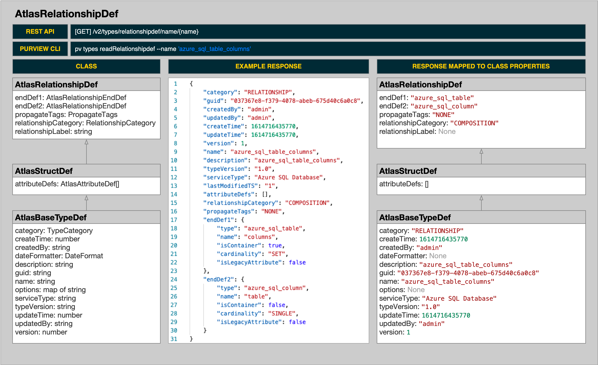

---

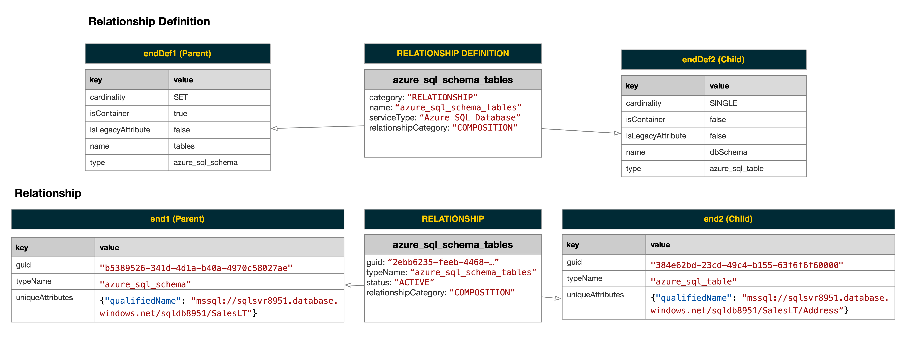

---

## :rocket: Getting Started

---

<!-- _footer: "https://docs.microsoft.com/en-us/azure/purview/tutorial-using-rest-apis#prerequisites" -->


### :thinking: Prerequisites

- An existing **Azure Purview** account.
- You will need sufficient permissions to **register** an application (i.e. service principal) within your Azure AD tenant.
- You will need sufficient permissions to assign the application a **role** (e.g. `Purview Data Curator`) in order for Azure Purview to trust your new service principal.

---

<!-- _footer: "https://docs.microsoft.com/en-us/azure/purview/tutorial-using-rest-apis#create-a-service-principal-application" -->


### :globe_with_meridians: Create a Service Principal

1. From the [Azure Portal](https://portal.azure.com), navigate to **Azure Active Directory**.
2. Select **App registrations**.
3. Select **New registration**.
4. Populate the **Register an application** form.  

    - Name (e.g. `purviewapi`)
    - Supported account types (e.g. `Single tenant`)
    - Redirect URI (*this can be left blank*)

5. Click **Register**.

---

6. Copy the values **Application (client) ID** and the **Directory (tenant) ID** for later use.

    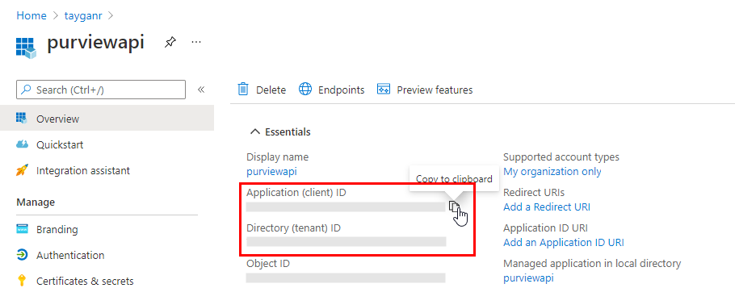

---

<!-- _footer: "https://docs.microsoft.com/en-us/azure/purview/tutorial-using-rest-apis#create-a-service-principal-application" -->


### :key: Create a Client Secret

In order to use the service principal, we need generate a password (aka client secret).

1. From the [Azure Portal](https://portal.azure.com), navigate to **Azure Active Directory**.
2. Select **App registrations**.
3. Select your service principal from the list.
4. Select **Certificates & secrets**.
5. Select **New client secret**.
6. On the **Add a client secret** form, enter a **Description**, select an expiration period under **Expires**, and then select **Add**.

---

7. Copy the value **client secret**  for later use.

    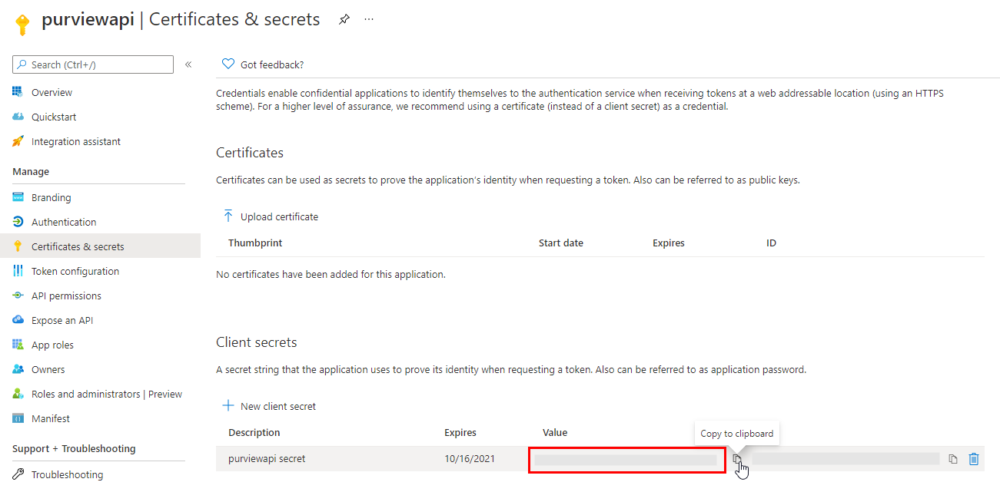

---

<!-- _footer: "https://docs.microsoft.com/en-us/azure/purview/tutorial-using-rest-apis#create-a-service-principal-application" -->


### :lock: Configure Azure Purview to Trust the Service Principal

1. From the [Azure Portal](https://portal.azure.com), navigate to your **Azure Purview** account.
2. Select **Access control (IAM)**.
3. Select **Add role assignments**.
4. For **Role**, select `Purview Data Curator`.
5. For **Assign access to**, leave the default `User, group, or service principal`.
6. For **Select**, enter the name of the service principal (e.g. `purviewapi`) and then click on the name in the results pane.
7. Click **Save**.

---

### :unlock: Request an Access Token

###### Request
| Property | Value |
| -------------: | :------------- |
| Method | POST |
| Endpoint | `https://login.microsoftonline.com/YOUR_TENANT_ID/oauth2/token` |
| Body Type | x-form-urlencoded |

###### Body (x-form-urlencoded)
| Key | Value |
| -------------: | :------------- |
| grant_type | client_credentials |
| client_id | `YOUR_CLIENT_ID` |
| client_secret | `YOUR_CLIENT_SECRET` |
| resource | https://purview.azure.net |

<style>
table {
    font-size: 16px;    
},
table th {
    background-color: black;
    color: white;
}
table td {
    background-color: white;
}
table td:nth-child(1) {
    font-weight: bold;
    background-color: #DCDCDC;
}
</style>

---

### :envelope: Request an Access Token (Postman)

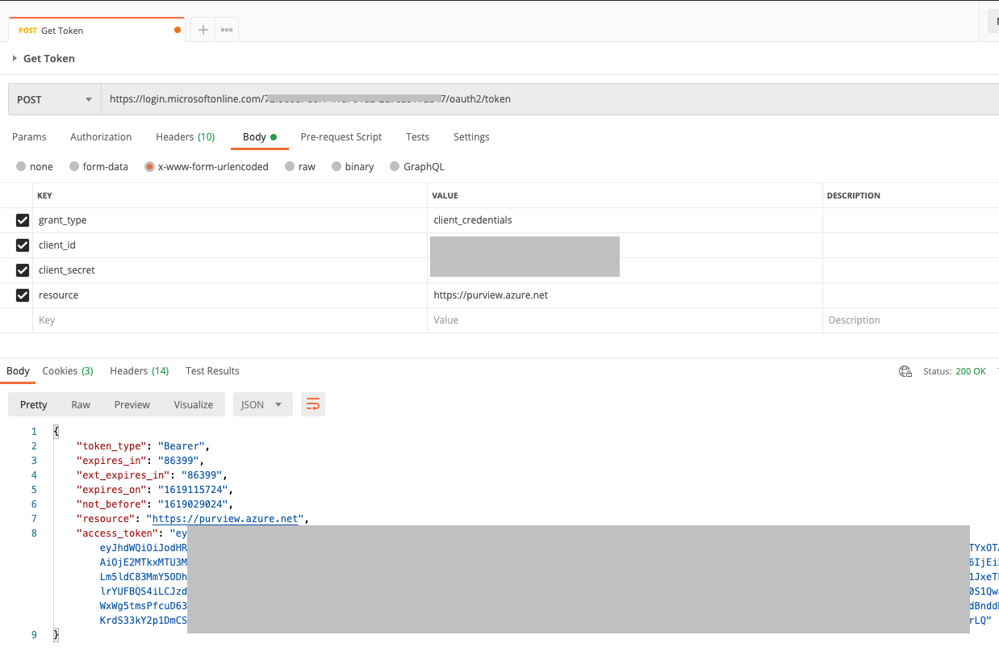

---

### :snake: Request an Access Token (Python)

```python
# Set Variables
AZURE_CLIENT_ID = "YOUR_CLIENT_ID"
AZURE_TENANT_ID = "YOUR_TENANT_ID"
AZURE_CLIENT_SECRET = "YOUR_CLIENT_SECRET"

# Prepare Request
data = {
    'grant_type': 'client_credentials',
    'client_id': AZURE_CLIENT_ID,
    'client_secret': AZURE_CLIENT_SECRET,
    'resource': 'https://purview.azure.net',
}
url = 'https://login.microsoftonline.com/{0}/oauth2/token'.format(AZURE_TENANT_ID)

# Get Access Token
import requests
request = requests.post(url, data=data)
response = request.json()
access_token = response['access_token']
print(access_token)
```

---

## :open_book: Examples

---

### :gear: 1.1 Retrieve all glossaries

###### Request
| Property | Value |
| -------------: | :------------- |
| Method | GET |
| Endpoint | `https://YOUR_PURVIEW_ACCOUNT.catalog.purview.azure.com/api/atlas/v2/glossary` |

###### Headers
| Key | Value |
| -------------: | :------------- |
| Authorization | `Bearer YOUR_ACCESS_TOKEN` |

---

### :snake: 1.2 Retrieve all glossaries (Python)

```python
# Set Variables
ATLAS_ENDPOINT = "https://YOUR_PURVIEW_ACCOUNT.catalog.purview.azure.com"
ACCESS_TOKEN = "YOUR_ACCESS_TOKEN"

# Prepare Request
url = '{0}/api/atlas/v2/glossary'.format(ATLAS_ENDPOINT)
headers = {'Authorization': 'Bearer {0}'.format(ACCESS_TOKEN)}

# Get Data
import requests
import json
request = requests.get(url, headers=headers)
response = request.json()
print(json.dumps(response, indent=4))
```

---

### :computer: 1.3 Retrieve all glossaries ([purviewcli](https://aka.ms/purviewcli))

`pv glossary read`

---

### :gear: 2.1 Create a custom type (classification)

###### Request
| Property | Value |
| -------------: | :------------- |
| Method | POST |
| Endpoint | `https://YOUR_PURVIEW_ACCOUNT.catalog.purview.azure.com/api/atlas/v2/types/typedefs` |

###### Headers
| Key | Value |
| -------------: | :------------- |
| Authorization | `Bearer YOUR_ACCESS_TOKEN` |
| Content-Type | application/json |

---

###### Body (Example Payload)

```json
{
    "classificationDefs": [
        {
            "category": "CLASSIFICATION",
            "description": "This is a custom classification.",
            "name": "TAYGAN.CUSTOM.CLASSIFICATION"
        }
    ]
}
```

---

### :snake: 2.2 Create a custom classification (Python)

```python
# Set Variables
ATLAS_ENDPOINT = "https://YOUR_PURVIEW_ACCOUNT.catalog.purview.azure.com"
ACCESS_TOKEN = "YOUR_ACCESS_TOKEN"

# Prepare Request
url = '{0}/api/atlas/v2/types/typedefs'.format(ATLAS_ENDPOINT)
headers = {
    'Authorization': 'Bearer {0}'.format(ACCESS_TOKEN),
    'Content-Type': 'application/json'
}
data = {
    "classificationDefs": [{
        "category": "CLASSIFICATION",
        "description": "This is a custom classification.",
        "name": "TAYGAN.CUSTOM.CLASSIFICATION"
    }]
}

# Create Type
request = requests.post(url, headers=headers, json=data)
response = request.json()
print(json.dumps(response, indent=4))
```

---

### :gear: 3.1 Delete a custom type (classification)

###### Request
| Property | Value |
| -------------: | :------------- |
| Method | DELETE |
| Endpoint | `https://YOUR_PURVIEW_ACCOUNT.catalog.purview.azure.com/api/atlas/v2/types/typedef/name/{name}` |

###### Headers
| Key | Value |
| -------------: | :------------- |
| Authorization | `Bearer YOUR_ACCESS_TOKEN` |

---

### :snake: 3.2 Delete a custom classification (Python)

```python
# Set Variables
ATLAS_ENDPOINT = "https://YOUR_PURVIEW_ACCOUNT.catalog.purview.azure.com"
ACCESS_TOKEN = "YOUR_ACCESS_TOKEN"

# Prepare Request
classification_name = 'TAYGAN.CUSTOM.CLASSIFICATION'
url = '{0}/api/atlas/v2/types/typedef/name/{1}'.format(ATLAS_ENDPOINT, classification_name)
headers = {'Authorization': 'Bearer {0}'.format(ACCESS_TOKEN)}

# Delete Type
request = requests.delete(url, headers=headers)
print(request.status_code)
```

---

### :gear: 4.1 Get an entity

###### Request
| Property | Value |
| -------------: | :------------- |
| Method | GET |
| Endpoint | `https://YOUR_PURVIEW_ACCOUNT.catalog.purview.azure.com/api/atlas/v2/entity/guid/{guid}` |

###### Headers
| Key | Value |
| -------------: | :------------- |
| Authorization | `Bearer YOUR_ACCESS_TOKEN` |

---

### :snake: 4.2 Get an entity (Python)

```python
# Set Variables
ATLAS_ENDPOINT = "https://YOUR_PURVIEW_ACCOUNT.catalog.purview.azure.com"
ACCESS_TOKEN = "YOUR_ACCESS_TOKEN"

# Prepare Request
guid = 'f0a9c131-8cad-4fa9-928d-f4f6f6f60000'
url = '{0}/api/atlas/v2/entity/guid/{1}'.format(ATLAS_ENDPOINT, guid)
headers = {'Authorization': 'Bearer {0}'.format(ACCESS_TOKEN)}

# Get Entity
request = requests.get(url, headers=headers)
response = request.json()
print(json.dumps(response, indent=4))
```

---

### :gear: 5.1 Create an entity

###### Request
| Property | Value |
| -------------: | :------------- |
| Method | POST |
| Endpoint | `https://YOUR_PURVIEW_ACCOUNT.catalog.purview.azure.com/api/atlas/v2/entity` |

###### Headers
| Key | Value |
| -------------: | :------------- |
| Authorization | `Bearer YOUR_ACCESS_TOKEN` |
| Content-Type | application/json |

---

###### Body (Example Payload)

```json
{
    "entity": {
        "typeName": "azure_sql_table",
        "attributes": {
            "qualifiedName": "mssql://sqlsvr8951.database.windows.net/sqldb8951/SalesLT/CustomEntity",
            "name": "CustomEntity",
            "description": "This is a custom entity."
        }
    }
}
```

---

### :snake: 5.2 Create an entity (Python)

```python
# Set Variables
ATLAS_ENDPOINT = "https://YOUR_PURVIEW_ACCOUNT.catalog.purview.azure.com"
ACCESS_TOKEN = "YOUR_ACCESS_TOKEN"

# Prepare Request
url = '{0}/api/atlas/v2/entity'.format(ATLAS_ENDPOINT)
headers = {
    'Authorization': 'Bearer {0}'.format(ACCESS_TOKEN),
    'Content-Type': 'application/json'
}
data = {
    "entity": {
        "typeName": "azure_sql_table",
        "attributes": {
            "qualifiedName": "mssql://sqlsvr8951.database.windows.net/sqldb8951/SalesLT/CustomEntity",
            "name": "CustomEntity",
            "description": "This is a custom entity."
        }
    }
}

# Create Type
request = requests.post(url, headers=headers, json=data)
response = request.json()
print(json.dumps(response, indent=4))
```

---

### :gear: 6.1 Delete an entity

###### Request
| Property | Value |
| -------------: | :------------- |
| Method | DELETE |
| Endpoint | `https://YOUR_PURVIEW_ACCOUNT.catalog.purview.azure.com/api/atlas/v2/entity/guid/{guid}` |

###### Headers
| Key | Value |
| -------------: | :------------- |
| Authorization | `Bearer YOUR_ACCESS_TOKEN` |

---

### :snake: 6.2 Delete an entity (Python)

```python
# Set Variables
ATLAS_ENDPOINT = "https://YOUR_PURVIEW_ACCOUNT.catalog.purview.azure.com"
ACCESS_TOKEN = "YOUR_ACCESS_TOKEN"

# Prepare Request
guid = 'e7714771-86c6-4083-84be-3df6f6f60000'
url = '{0}/api/atlas/v2/entity/guid/{1}'.format(ATLAS_ENDPOINT, guid)
headers = {'Authorization': 'Bearer {0}'.format(ACCESS_TOKEN)}

# Delete Type
request = requests.delete(url, headers=headers)
print(request.status_code)
```

---

### :gear: 7.1 Get a relationship

###### Request
| Property | Value |
| -------------: | :------------- |
| Method | GET |
| Endpoint | `https://YOUR_PURVIEW_ACCOUNT.catalog.purview.azure.com/api/atlas/v2/relationship/guid/{guid}` |

###### Headers
| Key | Value |
| -------------: | :------------- |
| Authorization | `Bearer YOUR_ACCESS_TOKEN` |

---

### :snake: 7.2 Get a relationship (Python)

```python
# Set Variables
ATLAS_ENDPOINT = "https://YOUR_PURVIEW_ACCOUNT.catalog.purview.azure.com"
ACCESS_TOKEN = "YOUR_ACCESS_TOKEN"

# Prepare Request
guid = '86e9c889-5fd4-4f44-b086-9fa9e974f9d0'
url = '{0}/api/atlas/v2/relationship/guid/{1}'.format(ATLAS_ENDPOINT, guid)
headers = {'Authorization': 'Bearer {0}'.format(ACCESS_TOKEN)}

# Get Entity
request = requests.get(url, headers=headers)
response = request.json()
print(json.dumps(response, indent=4))
```

---


### :gear: 8.1 Create a relationship (custom lineage)

###### Request
| Property | Value |
| -------------: | :------------- |
| Method | POST |
| Endpoint | `https://YOUR_PURVIEW_ACCOUNT.catalog.purview.azure.com/api/atlas/v2/relationship` |

###### Headers
| Key | Value |
| -------------: | :------------- |
| Authorization | `Bearer YOUR_ACCESS_TOKEN` |
| Content-Type | application/json |

---

###### Body (Example Payload)

```json
{
    "typeName":"process_dataset_outputs",
    "end1":{
        "guid":"8cf4916b-a0a6-4c21-9efe-1e6c43fe886c",
        "typeName":"adf_copy_activity",
        "uniqueAttributes":{
        "qualifiedName":"/subscriptions/2c334b6c-e5...."
        }
    },
    "end2":{
        "guid":"7ccc6d67-7a15-42a6-8fd8-39f6f6f60000",
        "typeName":"azure_sql_table",
        "uniqueAttributes":{
        "qualifiedName":"mssql://sqlsvr8951.database.windows.net/sqldb8951/Taygan/TwitterOne"
        }
    }
}
```

---

### :snake: 8.2 Create a relationship (custom lineage)

```python
# Set Variables
ATLAS_ENDPOINT = "https://YOUR_PURVIEW_ACCOUNT.catalog.purview.azure.com"
ACCESS_TOKEN = "YOUR_ACCESS_TOKEN"

# Prepare Request
url = '{0}/api/atlas/v2/relationship'.format(ATLAS_ENDPOINT)
headers = {
    'Authorization': 'Bearer {0}'.format(ACCESS_TOKEN),
    'Content-Type': 'application/json'
}
data = {
    "typeName":"process_dataset_outputs",
    "end1":{
        "guid":"8cf4916b-a0a6-4c21-9efe-1e6c43fe886c",
        "typeName":"adf_copy_activity",
        "uniqueAttributes":{
        "qualifiedName":"/subscriptions/2c334b6c-e5...."
        }
    },
    "end2":{
        "guid":"7ccc6d67-7a15-42a6-8fd8-39f6f6f60000",
        "typeName":"azure_sql_table",
        "uniqueAttributes":{
        "qualifiedName":"mssql://sqlsvr8951.database.windows.net/sqldb8951/Taygan/TwitterOne"
        }
    }
}

# Create Type
request = requests.post(url, headers=headers, json=data)
response = request.json()
print(json.dumps(response, indent=4))
```

---

### :gear: 9.1 Delete a relationship

###### Request
| Property | Value |
| -------------: | :------------- |
| Method | DELETE |
| Endpoint | `https://YOUR_PURVIEW_ACCOUNT.catalog.purview.azure.com/api/atlas/v2/relationship/guid/{guid}` |

###### Headers
| Key | Value |
| -------------: | :------------- |
| Authorization | `Bearer YOUR_ACCESS_TOKEN` |

---

### :snake: 9.2 Delete a relationship (Python)

```python
# Set Variables
ATLAS_ENDPOINT = "https://YOUR_PURVIEW_ACCOUNT.catalog.purview.azure.com"
ACCESS_TOKEN = "YOUR_ACCESS_TOKEN"

# Prepare Request
guid = 'dab534c8-ace7-49be-95a1-def4e394c74a'
url = '{0}/api/atlas/v2/relationship/guid/{1}'.format(ATLAS_ENDPOINT, guid)
headers = {'Authorization': 'Bearer {0}'.format(ACCESS_TOKEN)}

# Delete Type
request = requests.delete(url, headers=headers)
print(request.status_code)
```