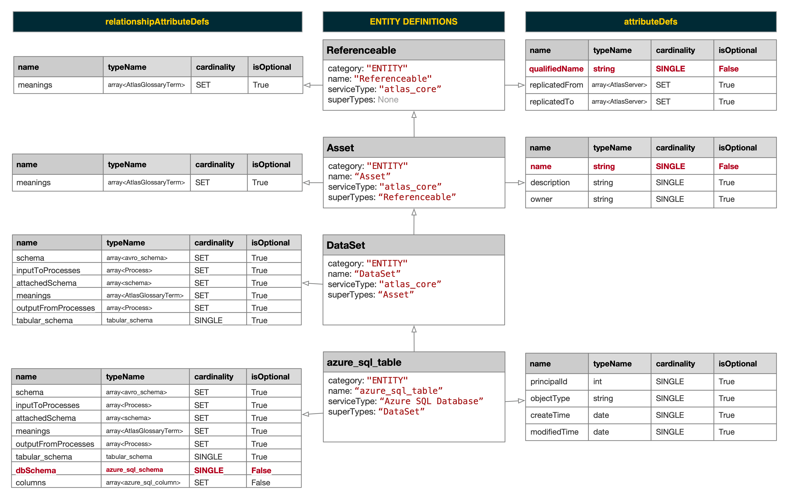

# Azure Purview  REST API

[aka.ms/purviewapi](https://aka.ms/purviewapi)

---

## :helicopter: High-Level Overview

---

<!-- _footer: "Azure Purview High-Level Concepts" -->

---

## :world_map: Apache Atlas

---
<!-- _footer: "https://atlas.apache.org/" -->

### :world_map: Apache Atlas

> *"Apache Atlas provides open metadata management and governance capabilities for organizations to build a catalog of their data assets, classify and govern these assets and provide collaboration capabilities around these data assets for data scientists, analysts and the data governance team."*

---
<!-- _footer: "https://atlas.apache.org/" -->

### :clock1: Apache Atlas Milestones

* 2015-01-28 [Hortonworks Establishes Data Governance Initiative](https://www.prnewswire.com/news-releases/hortonworks-establishes-data-governance-initiative-300026958.html)
* 2015-05-06 [Apache Atlas submitted to the Apache Software Foundation](https://incubator.apache.org/projects/atlas.html)
* 2017-06-21 [Apache Atlas graduates to a Top-Level Project](https://incubator.apache.org/projects/atlas.html)
* 2018-06-02 [Apache Atlas 1.0.0](https://atlas.apache.org/1.0.0/Downloads.html)
* 2019-05-04 [Apache Atlas 2.0.0](https://atlas.apache.org/2.0.0/Downloads.html)
* 2020-07-15 [Apache Atlas 2.1.0](https://atlas.apache.org/#/Downloads) *(Latest)*

---

<!-- _footer: "https://atlas.apache.org/api/v2/ui/index.html#/" -->

### :computer: Apache Atlas REST API

---

<!-- _footer: "https://atlas.apache.org/2.0.0/TypeSystem.html" -->

### :book: Apache Atlas Type System
> *"Atlas allows users to define a model for the metadata objects they want to manage. The model is composed of definitions called ‘types’. Instances of ‘types’ called ‘entities’ represent the actual metadata objects that are managed. The Type System is a component that allows users to define and manage the types and entities. All metadata objects managed by Atlas out of the box (like Hive tables, for e.g.) are modelled using types and represented as entities. To store new types of metadata in Atlas, one needs to understand the concepts of the type system component."*

---

<!-- _footer: "https://atlas.apache.org/api/v2/json_AtlasTypesDef.html" -->

### :book: Apache Atlas Type Definitions

---

---

---

---

<!-- _footer: "https://atlas.apache.org/2.0.0/TypeSystem.html" -->

### :blue_book: Entities
> *"An ‘entity’ in Atlas is a specific value or instance of an Entity ‘type’ and thus represents a specific metadata object in the real world. Referring back to our analogy of Object Oriented Programming languages, an ‘instance’ is an ‘Object’ of a certain ‘Class’."*

---

---

---

---

<!-- _footer: "https://atlas.apache.org/2.0.0/TypeSystem.html" -->

### :link: Relationships
> *"A ‘relationship’ can be established between entities (e.g. Table <---> Columns)." Relationships have 2 ends, each of which specify cardinality, an entityDef type name, and a name.*

---

---

---

## :rocket: Getting Started

---

<!-- _footer: "https://docs.microsoft.com/en-us/azure/purview/tutorial-using-rest-apis#prerequisites" -->

### :thinking: Prerequisites

* An existing **Azure Purview** account.
* You will need sufficient permissions to **register** an application (i.e. service principal) within your Azure AD tenant.
* You will need sufficient permissions to assign the application a **role** (e.g. `Purview Data Curator`) in order for Azure Purview to trust your new service principal.

---

<!-- _footer: "https://docs.microsoft.com/en-us/azure/purview/tutorial-using-rest-apis#create-a-service-principal-application" -->

### :globe_with_meridians: Create a Service Principal

1. From the [Azure Portal](https://portal.azure.com), navigate to **Azure Active Directory**.
2. Select **App registrations**.
3. Select **New registration**.
4. Populate the **Register an application** form.  

    * Name (e.g. `purviewapi`)
    * Supported account types (e.g. `Single tenant`)
    * Redirect URI (*this can be left blank*)
5. Click **Register**.

---

6. Copy the values **Application (client) ID** and the **Directory (tenant) ID** for later use.

    

---

<!-- _footer: "https://docs.microsoft.com/en-us/azure/purview/tutorial-using-rest-apis#create-a-service-principal-application" -->

### :key: Create a Client Secret

In order to use the service principal, we need generate a password (aka client secret).

1. From the [Azure Portal](https://portal.azure.com), navigate to **Azure Active Directory**.
2. Select **App registrations**.
3. Select your service principal from the list.
4. Select **Certificates & secrets**.
5. Select **New client secret**.
6. On the **Add a client secret** form, enter a **Description**, select an expiration period under **Expires**, and then select **Add**.

---

7. Copy the value **client secret**  for later use.

    

---

<!-- _footer: "https://docs.microsoft.com/en-us/azure/purview/tutorial-using-rest-apis#create-a-service-principal-application" -->

### :lock: Configure Azure Purview to Trust the Service Principal

1. From the [Azure Portal](https://portal.azure.com), navigate to your **Azure Purview** account.
2. Select **Access control (IAM)**.
3. Select **Add role assignments**.
4. For **Role**, select `Purview Data Curator`.
5. For **Assign access to**, leave the default `User, group, or service principal`.
6. For **Select**, enter the name of the service principal (e.g. `purviewapi`) and then click on the name in the results pane.
7. Click **Save**.

---